# 100-Days-of-ML

## Day 1 (25-03-20) : Binary Classification
- Implement a Deep Neural Network for Classification of Cats and Dogs.
- Tweaked the model by feature scaling and hyperparameter tuning.
- Minimized overfitting by adding image augmentation through Image Data Generator.
- Achieved an accuracy of 90 percent without using any dense layers in the network. 
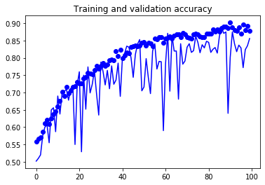 
- Model Link ~ https://colab.research.google.com/github/Sanyam8055/100-Days-of-ML/blob/master/catsvsdogs.ipynb
## Day 2 (26-03-20) : Multi-class Classification
- Implemented a Resnet20 for Multi-class classification on CIFAR100 dataset.
- Tweaked the Learning rate by applying LR reducer and LR scheduler.
- Model Link ~ https://colab.research.google.com/github/Sanyam8055/100-Days-of-ML/blob/master/Resnet20.ipynb
## Day 3 (27-03-20) : Neural Style Transfer 
- Runs on custom Image with an custom filter
- The model is uses characters of one Image as a filter 
- Tweaked the loss function to compute better results 

- Model Link ~ https://colab.research.google.com/drive/12cuuIp1JrTiuqhqS2YY6eRwZzClyN1Bg
## Day 4 (28-03-20) : Binary Person Classifier 
- Extracts important featuers from different datasets
- Identifies on a large variety of user-defined dataset 
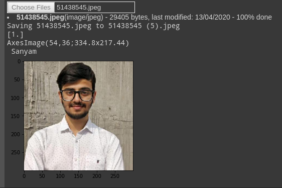
- Model Link ~https://colab.research.google.com/drive/12cuuIp1JrTiuqhqS2YY6eRwZzClyN1Bg
## Day 5 (29-03-20) : Mathematics for ML
- Studied Gaussien Naive Bayes theorem 
- Some concepts of sampling including Random Sampling, Systematic Sampling and Stratified Sampling.
- Statistic Strategy including Descriptive and Inferential.
- Link - https://machinelearningmastery.com/naive-bayes-for-machine-learning/
## Day 6 (30-03-20) : Keras Implementation of Custom Layer
- Custom layer with lecum_uniform and selu activation
- Specifically for SNN 
- Uses recursive loss to evaluate loss that going through the layer.
- Link for Layer ~ https://github.com/Sanyam8055/100-Days-of-ML/blob/master/Customdenselayer.py
## Day 7 (31-03-20) : Custom model for cifar10
- Model achieves an accuracy of 83 percent under 50 epochs
- Model is built up of convolutional layers with any involvement of dense layers. 

- Model Link ~ https://colab.research.google.com/drive/1TJml50aCS-wSTebExg-TvgOXFWOhHP0z
## Day 8 (01-04-20) : Music Generation using RNN
- Preprocessed the songs into vectorized text for the model
- Build a Recurrent neural network with LSTM and dense 
- Customized the loss function for the model
- Custom Song Link ~ https://drive.google.com/file/d/1NpjvOh9Kk9JqfEcO_hYsiSvGyxSPb0Rw/view?usp=sharing
## Day 9 (02-04-20) : Customized Music Generation 
- Customized the optimizer by hyperparameter tunning followed by tweaking the tape gradients 
- Tweaked the batch size,  changing the starting_string and altering the rnn_units
- Reduced the loss from scalar 4.4 to 0.5 
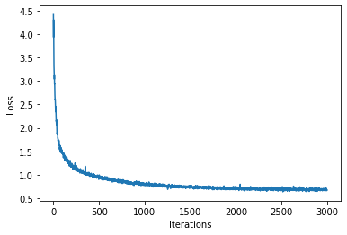
- Model Link ~ https://colab.research.google.com/github/Sanyam8055/100-Days-of-ML/blob/master/Music_Generator.ipynb
## Day 10 (03-04-20) : CNN on MNIST dataset
- Implemented a convolution neural network on MNIST handwritting dataset
- Using tape gradients concluded with the backpropogation
- Sidewise compared the cnn_model with full connected model 
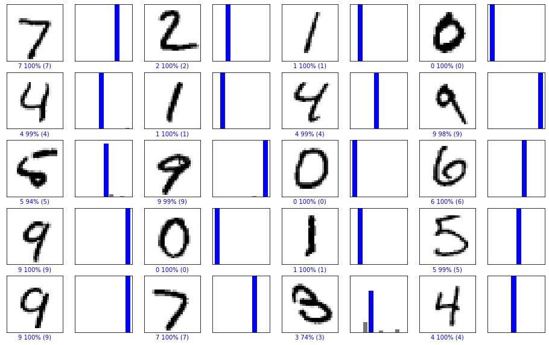
- Model Link ~ https://colab.research.google.com/github/Sanyam8055/100-Days-of-ML/blob/master/MNIST.ipynb
## Day 11 (04-04-20) : Variational Autoencoder 
- Build a facial detection model that learns form latent variables underlying face image dataset
- Adaptively re-sample the training data
- Mitigating any biases that may be present in order to train a debiased model 
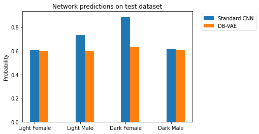
## Day 12 (05-04-20) : Optimized Variational Autoencoder 
- Tweaked the model while reducing the learning rate.
- Trained the model for longer num_cycles
- Better predictions on test dataset with optimum probality without any bias 
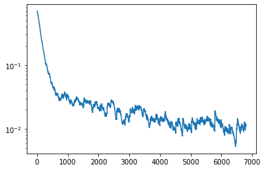
- Model Link ~ https://github.com/Sanyam8055/100-Days-of-ML/blob/master/Customized_VAE.ipynb
## Day 13 (06-04-20) : Cartpole through Reinforcement Learning 
-  The main objective of cartpole is to balance a rod kept on a subject while completely moving the surface within 2.4 units from the centre.
- Implemented MIT 6.S191 Lab 3 Cartpole with total reward of 200 under 1000 iterations 
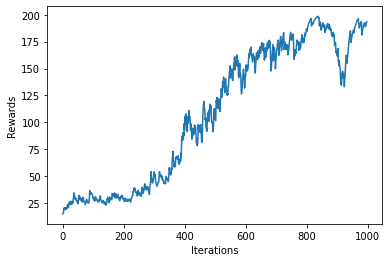
- Model Link ~ https://colab.research.google.com/github/aamini/introtodeeplearning/blob/master/lab3/RL.ipynb
## Day 14 (07-04-20) : Pong with AI
- Implemented a Reinforcement learning AI which plays PONG and beats the CPU
- Pong being one the most complex games the model is trained over 2000 iterations and effective reward system.
- Training took 6 hours on google colab. 
- Further optimization required! 
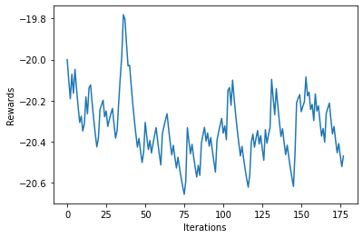
## Day 15 (08-04-20) : Enchanced Pong 
- Trained Pong over local setup which includes setting up tf GPU on NVDIA 1060ti 6GB.
- Trained for over 10k iterations and beats the cpu with ease. 
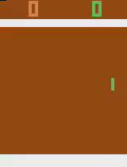
- Model Link ~ https://github.com/Sanyam8055/100-Days-of-ML/blob/master/untitled1.py
## Day 16 (09-04-20) : Papers and Papers
- Read about CGAN and its effectiveness on Face aging models.
- Read about CartoonGAN: Generative Adversarial Networks for Photo Cartoonization.
- Reads about Autoencoders and theirs differences with VAE.
## Day 17 (10-04-20) :Conditional Generative Adversarial Network
- Trained a CGAN for MNIST for 40k iterations
- Archieved discriminator accuracy of 72% and reduced Generator accuracy to 24% 
- cgan_mnist labels for generated images: [0 1 2 3 4 5 6 7 8 9 0 1 2 3 4 5] 

## Day 18 (11-04-20) : Custom CGAN 
- Customized model with better results
- Improved accuracy with hyper parameter tuning and increased training iterations
- Experimented with the weights  
[discriminator loss: 0.461816, acc: 0.734375] [adversarial loss: 1.522949, acc: 0.375000] 
[discriminator loss: 0.475403, acc: 0.796875] [adversarial loss: 1.922817, acc: 0.156250] 
[discriminator loss: 0.500307, acc: 0.765625] [adversarial loss: 2.060154, acc: 0.156250] 
[discriminator loss: 0.544482, acc: 0.750000] [adversarial loss: 1.687811, acc: 0.187500] 
- Model Link ~ https://colab.research.google.com/github/Sanyam8055/100-Days-of-ML/blob/master/Custom_cgan.ipynb 
## Day 19 (12-04-20) : Basic Flutter 
- Completed 6 sections of appbrewery course on flutter
- Implemented basic card app with proper User interface
- Added multiple attributes and adjusted their display. 

## Day 20 (13-04-20) : Flutter Realtime Object Detection using tflite
- Flutter app for object detection through camera with accurate estimate of object and their pose.
- Works with models such as ssd-mobilenet, yolo, mobilenet and poseNet.
- Completed 2 sections of appbrewery course on flutter
- Got some really interesting results. 

## Day 21 (14-04-20) : Flutter Dice App
- Flutter app for dice using Flatbottons and generating random values with random library of dart.
- User friendly and can be integrated in many games.
- Completed 2 sections of appbrewery course on flutter 

## Day 22 (15-04-20) : Mathematics for ML
- Revised some concepts of numpy, pandas with Statistics.
- Built an basic OCR for Image Detection which is going to be used for Document Detection.
- Some major concepts of VAE in Deep learning through CMU Introduction to Deep Learning 12.
## Day 23 (16-04-20) :Camera/Gallery Plugin Flutter
- Built a flutter app that uses camera or gallery image as input.
- Displays the selected real time or previously clicked image on the home page.
- Further going to add some filters on the image using flutter ML toolkit. 
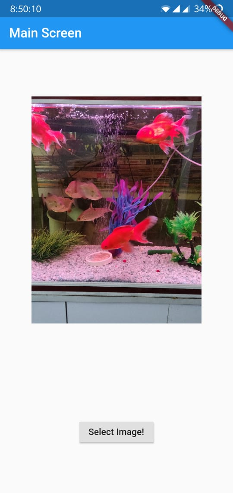

## Day 24 (17-04-20) : Revision of Machine Learning 
- Completed one assignment of SHALA2020 with begineers testing code of numpy,pandas and matplot.
- Filled the missing values with mean of the columns and normalized some columns as required.
- Performs some operations and displayed the results of sin functions using matplot.pyplot 
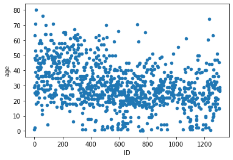
- Model Link ~ https://colab.research.google.com/github/Sanyam8055/100-Days-of-ML/blob/master/Shala_2020_DS.ipynb
## Day 25 (18-04-20) : Logistic Regression with a Neural Network mindset
- Completed 2 Weeks of Neural Networks and Deep Learnign course by Deep Learning.AI
- Completed the first programming assignment of Implementing A neural network for Logistic Regression on a Cat dataset.
- Improved the model and successfully got an accuracy of 80% 

- Model Link ~ https://github.com/Sanyam8055/100-Days-of-ML/blob/master/Logistic_Regression_with_a_Neural_Network_mindset_v6a.ipynb
## Day 26 (19-04-20) : SHALA2020 ASST on Data Science
- Completed one assignment of SHALA2020 with begineers testing code of pandas and numpy on movie dataset and train dataset of people who left an org after undergoing changes.
- Done all the Data Preprosseing and Visualization on both the datasets. 
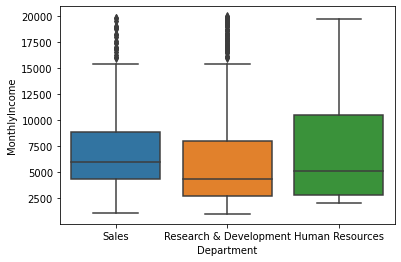
- Model Link ~ https://colab.research.google.com/github/Sanyam8055/100-Days-of-ML/blob/master/DS_L2_17_Apr_Assignment_2_DS.ipynb
## Day 27 (20-04-20) : Planer Data Classification
- Completed week 3rd of Deep learning.AI with a programming assignment on Forward and Backward Propogation of Neutral Network
- Implemented a Neural Network with Relu activation followed by tanh and signmoid on flower dataset.   
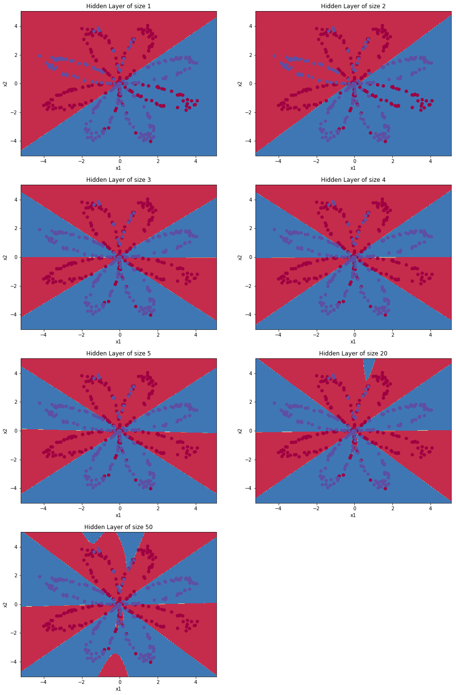
- Model Link ~ https://github.com/Sanyam8055/100-Days-of-ML/blob/master/Planar_data_classification_with_onehidden_layer_v6c.ipynb
## Day 28 (21-04-20) : Deep Neural Network Application
- Completed Neural Network and Deep Learning course of deeplearning.ai. 
- Implemented grader functions such as linear_forward_activation, linear_backward_activations to update the parameters after every desent.
- Used these fucntions to train a Binary Classifier of Cats in separate notebook. 
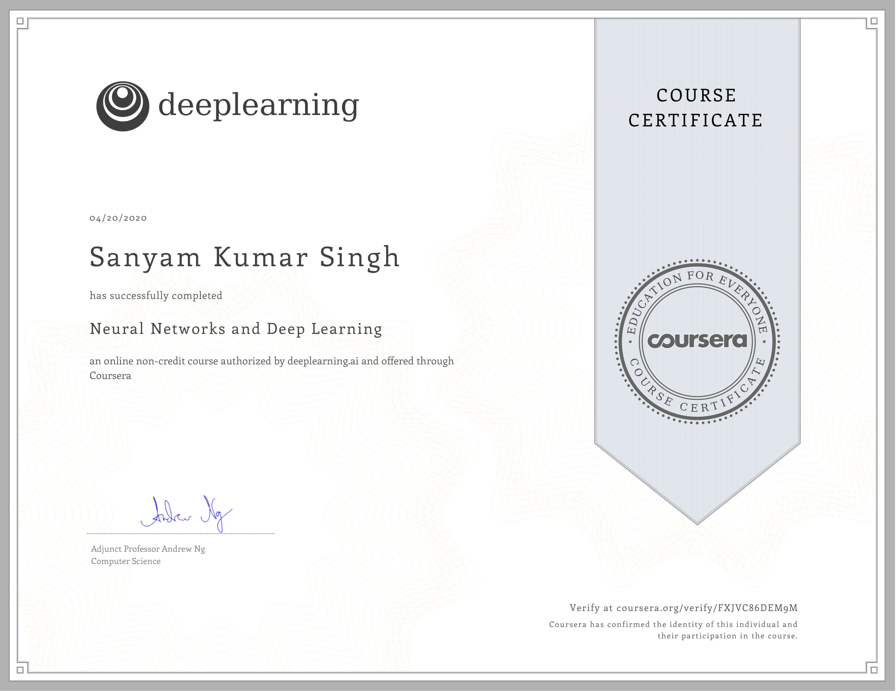 
- Model Link ~ https://github.com/Sanyam8055/100-Days-of-ML/blob/master/Building_your_Deep_Neural_Network_Step_by_Step_v8a.ipynb
## Day 29 (22-04-20) : Data Visualisations
- Learned implementation of histogram, stacked graphs, heatmap.
- Implemented a mask on the heatmap to remove duplicate values on the heatmap. 
- Implemented the probability distributions in seaborn and matplotlib
- Completed the assignment exercise for visualisation given by the IITB course 
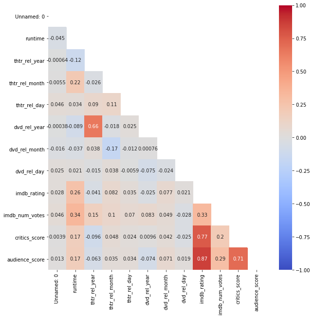
- Model Link ~ https://github.com/Sanyam8055/100-Days-of-ML/blob/master/DS_L3_20_April_Assignment_3.ipynb
## Day 30 (23-04-20) : Improving Deep Neural Networks
-  Implemented Initialization, Regularization and Gradient Checking Checking notebooks.
- Worked on Random Initialization, He Initialization and Zeros Initialzation and found He Initialization fetching the best Results.  
- Tried different Regularizations Techniques and concluded with Dropout as one  of the best Technique fetching 98% Test Accuracy.
- Performed and Verified Gradients Testing while performing forward and backward propogation
- Completed 3 programming asst in Deeplearning.ai course. 

- Model Link ~ https://github.com/Sanyam8055/100-Days-of-ML/blob/master/Initialization.ipynb
- Model Link ~ https://github.com/Sanyam8055/100-Days-of-ML/blob/master/Regularization_v2a.ipynb
- Model Link ~ https://github.com/Sanyam8055/100-Days-of-ML/blob/master/Gradient%2BChecking%2Bv1.ipynb
## Day 31 (24-04-20) : Optimization Methods
-  Tried Gradient Desent, Momentum and Adam Optimization aproaches.
- Implemented all of them on minibatches to get better results.
- Adam Fetched 94% Accuracy wheras Momentum and Gradient Desecent worked out with ~80% accuracy. 
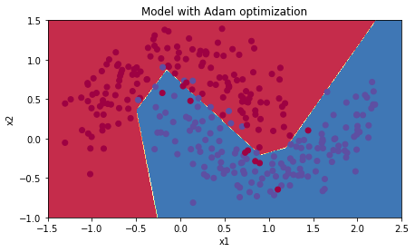
- Model Link ~ https://github.com/Sanyam8055/100-Days-of-ML/blob/master/Optimization_methods_v1b.ipynb
## Day 32 (25-04-20) : ML Statistics
-  Studied Probabiltity Density Distribution and implement pdf on exponential function.
- Defined the likelihood and log-likehood of the two samples with lambda=1 and lambda=2
- Calculated the T statistic using the degrees of freedom 
- Compared the critical value with the T statistics and evaluated whether null Hypothesis is accepted. 
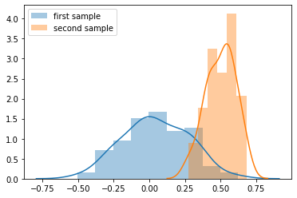
- Model Link ~ https://colab.research.google.com/drive/1uaomeRGt1pv9eYsgmRDQoKg84h4oejNX
## Day 33 (26-04-20) : Attrition for the employees
-  Implemented a model to predict the attrition of Employees using Random Forest Classifier, XG Boost, Gradient Boosting.
- Compared their results,f1 score, percision value and ROC curve for all the three classifiers.
- Gradient Boost works best on the given dataset with 86% test accuracy whereas RFC gives 77% and XG Boost gives 84%.
- Here is the ROC curve for Gradient Boost 
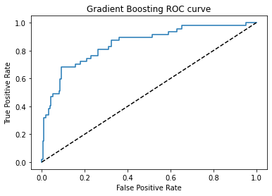
- Model Link ~ https://colab.research.google.com/drive/1ouqdnDJaf2dckf7SRbeBUBYeesJszXZ3
## Day 34 (27-04-20) : Worked on Sign Dataset with tensorflow
-  Implemented an Neural Network for prediction of hand sign from 0 to 5
- Improved the model with Optimization, BatchNormalisation and regularisation with dropouts
- Complete the course on Improving Deep Neural Networks: Hyperparameter tuning, Regularization and Optimization 
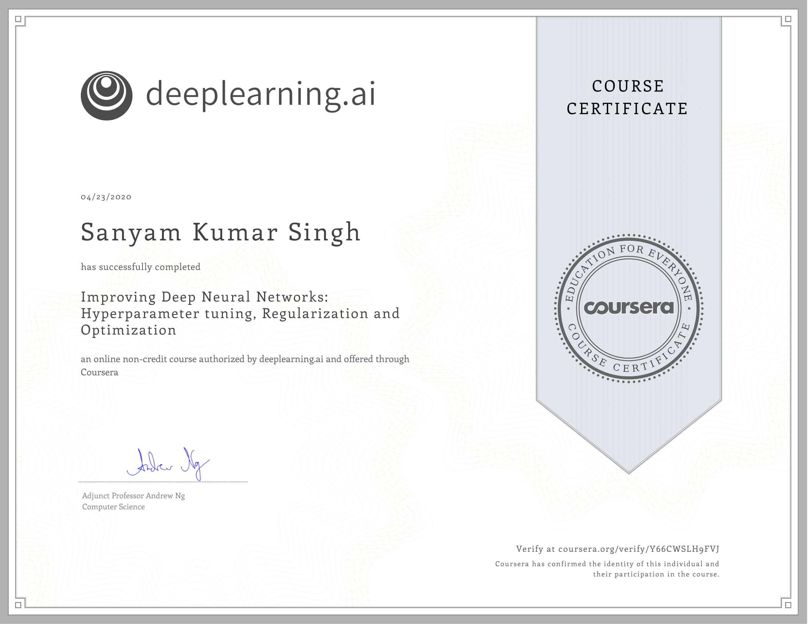 
- Model Link ~ https://github.com/Sanyam8055/100-Days-of-ML/blob/master/TensorFlow_Tutorial_v3b.ipynb
## Day 35 (28-04-20) : Structuring Machine Learning Projects
-  Complete the course 'Structuring Machine Learning Projects' by Andrew NG under depplearning.ai.
- The course consists of 2 Week lectures followed by quiz which tests the approach one needs to go through while implementing the model, studying the overfitting problem, judging variance and bias under training and testing with their solutions 
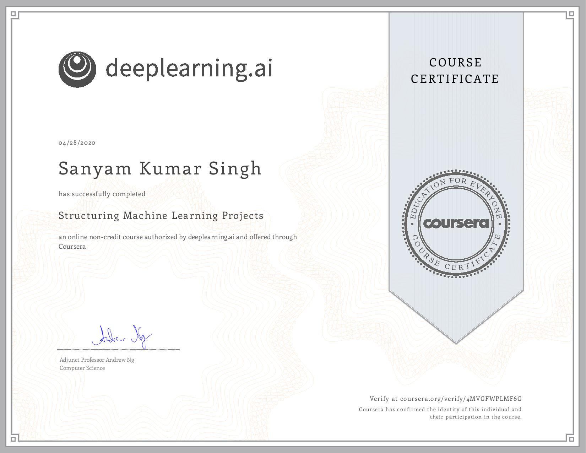 
## Day 36 (29-04-20) : Decision Trees on Titanic Dataset
- Preprocessed the data while dealing with missing values under Age, Cabin and Embarked. Label encoded some of the values then procceded with the model 
- Implemented a model to predict the Survival of a person using Random Forest Classifier, XG Boost, Gradient Boosting,Decision Tree Classifier and Logistic Regression.
- Compared their results,f1 score, percision value and ROC curve for all the three classifiers.
- XG Boost works best on the given dataset with 87% test accuracy whereas RFC gives 83% and Gradient Boost gives 83%.
Decision Tree classifier gives 83 and LR gaves 82.
- The Ruc of the dataset is 88.25 and XG Boost works pretty close.
- Here is the ROC curve for XG Boost 
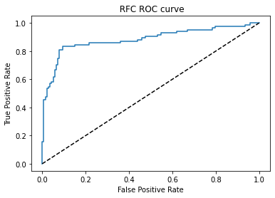 
- Model Link ~ https://github.com/Sanyam8055/100-Days-of-ML/blob/master/Assignment_ML_L2.ipynb
## Day 37 (30-04-20) : Convolutional Neural Networks: Step by Step
- Completed Week 1 of Convolutional Neural Networks by Andrew NG
- Worked on implementing Convolution Network networks from scratch which including writing the function of convolution layers, Pooling Layers, padding functions for forward and backward propogation.
- Worked on the same application through tensorflow which is one the best framework fo implementing models providing the required libraries and already implemented functions to save time implementing model from scrath. 

 
- Model Link ~ https://github.com/Sanyam8055/100-Days-of-ML/blob/master/Convolution_model_Step_by_Step_v2a.ipynb
- Model Link ~ https://github.com/Sanyam8055/100-Days-of-ML/blob/master/Convolution_model_Application_v1a.ipynb
## Day 38 (01-05-20) : Residual Networks
- Completed Week 2 of Convolutional Neural Networks by Andrew NG
- Implemented Resnet50 Architecture by buliding convolutional blocks and identify blocks and trained the model on Hand-sign dataset.
- Model still needs some optimization and tunning to run properly on actual images with good accuracy. 
 
- Model Link ~ https://github.com/Sanyam8055/100-Days-of-ML/blob/master/Residual_Networks_v2a%20(1).ipynb
## Day 39 (02-05-20) : Autonomous_driving_application_Car_detection
- Studied the YOLO algorithm and implemented yolo_filter_boxe, yolo_non_max_supression.
- Implemented YOLO v3 model functions from scratch for detection of cars, buses and 78 other classes. 
- Completed Week 3 of Convolutional Neural Networks by Andrew NG 
 
- Model Link ~ https://github.com/Sanyam8055/100-Days-of-ML/blob/master/Autonomous_driving_application_Car_detection_v3a.ipynb
## Day 40 (03-05-20) : Art Generation using Neural Networks 
- Implemented Neural Style Transfer from scratch under Andrew NG Convolution Neural Networks.
- Implemented the cost function of both the content and style Image and trained it on VGG19 Model with Adam Optimization
- Converted the input image with style image to an all new generated image based on the features generated by the 4th convolution layer. 
 
- Model Link ~https://github.com/Sanyam8055/100-Days-of-ML/blob/master/Art_Generation_with_Neural_Style_Transfer_v3a.ipynb
## Day 41 (04-05-20) : Facial Recognition 
- Implemented Facial Recognition from scratch using Neural Network under Andrew NG Convolution Neural Networks.
- Calculated triplet loss function for verfication purpose.
- Completed Convolutional Network Course by Andrew NG . 
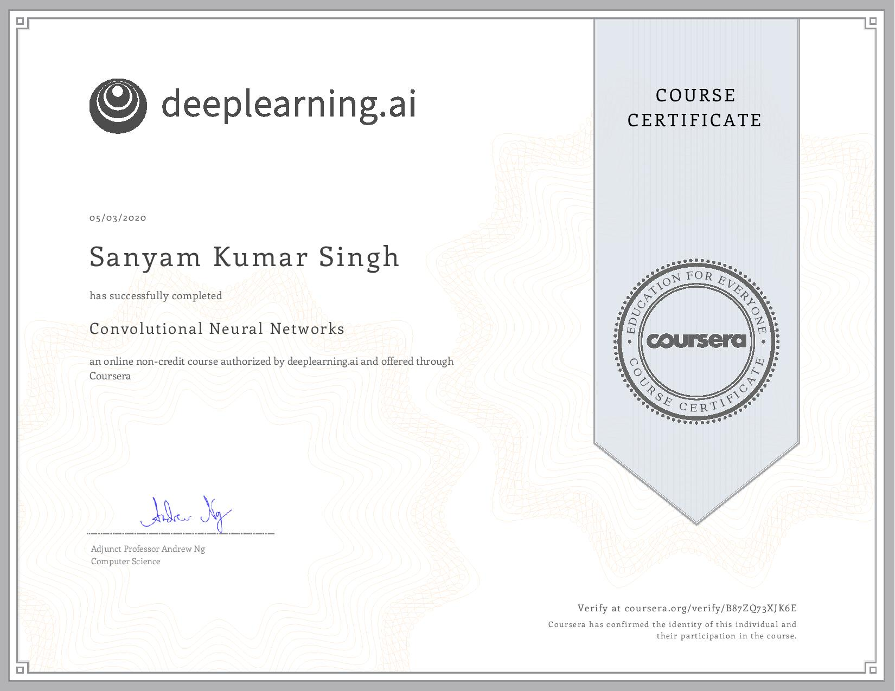 
- Model Link ~https://github.com/Sanyam8055/100-Days-of-ML/blob/master/Face_Recognition_v3a%20(1).ipynb
## Day 42 (05-05-20) : Papers on Pose Detection and Sentiment Analysis 
-  Read some papers on Implementing Pose detection with tensorflow Framework and TensorRT support.
- Pose Detection using models such as Random Forest and Logistic Regression
- Looking forward implmenting them. 